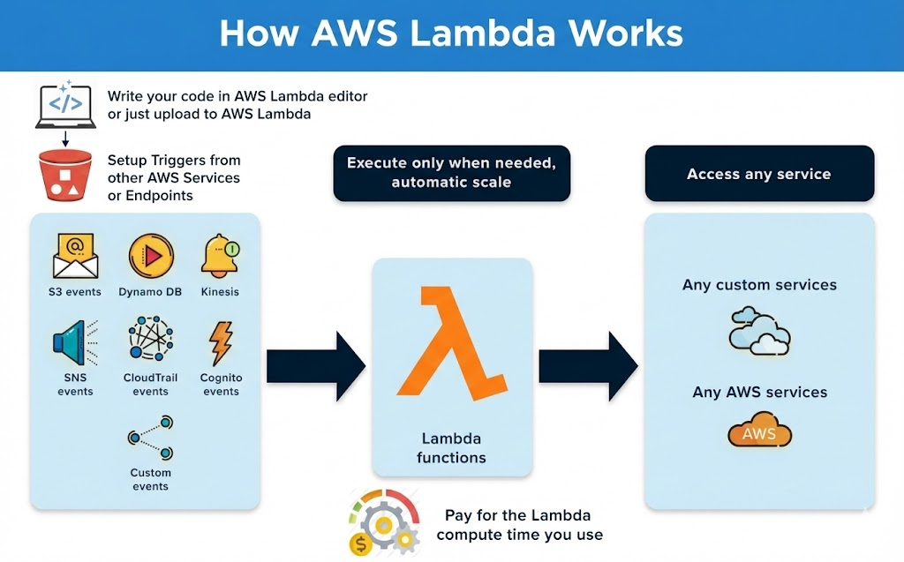

# AI6 Workshop 5
# "Scale or Fail" _(Orchestrating Complex ML Pipelines in Production)_

Welcome to today's workshop, which is designed for a 5‑hour coached session where:
- you **do not write code**
- you **do not debug code**
- everything is **evidence‑driven**
to teach you what you need to know about **scalability** in MLOps.

**The three mantras for today (say it all day):**
- **Scaling is the job.**
- **Orchestration is the mechanism.**
- **Root Cause Analysis (RCA) is the safety net.**

This will be explained in the short coach intro with the slides.

## Start here
- `coach/coach_playbook.md` — the run‑of‑show (what to say + what to click)
- `slides/morning_deck_scale_or_fail.pptx` and `slides/afternoon_deck_scale_or_fail.pptx` — ready to present
- `infra/ai6_u5w_scale_or_fail.yaml` — CloudFormation template (deployed by scripts)

## Sandbox assumptions (Pluralsight / A Cloud Guru)
We only use:
- Step Functions
- Lambda (3 functions)
- CloudWatch (dashboard + logs)
- CloudFormation + CloudShell

Region: **us-east-1** (recommended).

## Quick start (CloudShell)
1) Upload this zip into CloudShell (or download it inside CloudShell if you have a link).
2) Unzip it and enter the folder:
```bash
unzip ai6_unit5w_scale_or_fail_FINAL_QA.zip  # name may differ; use your uploaded filename
cd ai6_unit5w_scale_or_fail
chmod +x scripts/*.sh
```

3) Run the flow:
```bash
./scripts/00_set_region.sh
./scripts/01_deploy.sh
./scripts/02_invoke_one.sh
N=40 ./scripts/03_burst_load.sh
./scripts/05_trigger_bad_input.sh
NEW_RC=10 ./scripts/04_scale_up_embed_concurrency.sh
N=40 ./scripts/03_burst_load.sh
./scripts/99_cleanup.sh
```

## What you deploy
- Step Functions state machine: **Preprocess → Embed → Postprocess**
- 3 Lambda functions (Python 3.11)
- CloudWatch dashboard

The **Embed** step is intentionally configured with low reserved concurrency to create a **scaling wall**.

## Safety
Designed to be cheap and low-risk in a sandbox:
- burst size defaults to 40 (tweakable)
- no external model downloads
- no databases / queues / endpoints

## Key Lingo
Many of the terms that could be new to you are explained you in handouts/glossary.md.
An important but somewhat confusing pterm for today is **P95**, so let's look at it now:
__The P95 duration__ (95th percentile) _is a performance metric indicating that 95% of requests or transactions finish faster than a specific threshold, while the slowest 5% take longer. It is used to identify bottlenecks, measure the user experience for the slowest transactions, and ignore outliers that skew averages_

## Key Concept
An essential, but easy to grasp concept for today is AWS Lambda, so let's have a look how it works:
 

You're now ready to continue! Enjoy the workshop!
